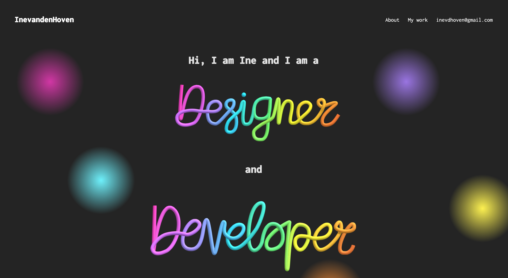

# Mijn portfolio

Voor de eerste Projectweek van de minor Web design & Development heb ik een portfolio gemaakt van al het werk dat ik op GitHub heb staan. De data die ik heb gebruikt komt van de GitHub API.

## Mijn Proces

Mijn proces kun je [hier](https://smooth-freeze-4ae.notion.site/Projectweek-1-5b8c77d8c5a54b678f43308a44c56e4f) lezen op Notion.

## Hoe gebruik je de GitHub API?

De GitHub API heeft veel verschillende linkjes die je kunt gebruiken om data op te halen. Ik heb de volgende linkjes gebruikt:

1. [https://api.github.com/users/Inevdhoven](https://api.github.com/users/Inevdhoven) - Hiermee haal ik verschillende informatie op van mijn GitHub account.
2. [https://api.github.com/users/Inevdhoven/repos](https://api.github.com/users/Inevdhoven/repos) - Hiermee haal ik alle repositories op van mijn GitHub account.

## Hoe installeer je mijn portfolio?

Wanneer je mijn portfolio lokaal wilt laten draaien, kun je de volgende stappen volgen:

1. Open de terminal en ga op zoek naar de map waar je de webapp wilt opslaan.
2. Clone de repository met de volgende commando: `git clone https://github.com/Inevdhoven/Portfolio-Minor-WEB.git`
3. Open de map in je code editor.
4. Open de terminal in je code editor en voer het volgende commando uit: `npm install`
5. Voer het volgende commando uit: `npm run dev`
6. Open de webapp in je browser door t klikken op de aangegeven link in de terminal

## Waar heb ik mijn project mee gemaakt?

Dit project is gemaakt met Vite met de talen Vue en TypeScript. Dit was de eerste keer dat ik met Vite, Vue en TypeScript heb gewerkt. Voor een week werken met nieuwe talen was best een uitdaging, ik snap nog lang niet alles, maar ik heb wel veel geleerd.

## License

Deze Single Page App maakt gebruik van een MIT License. Je kunt [hier](https://github.com/Inevdhoven/Portfolio-Minor-WEB/blob/main/LICENSE) meer lezen over de MIT License.
